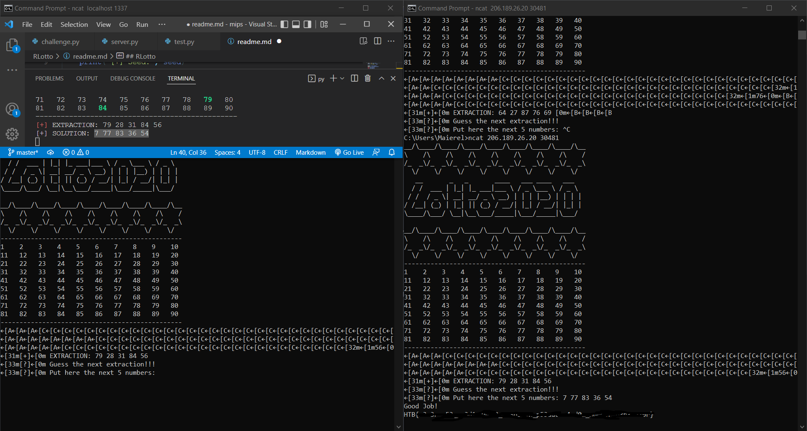

# RLotto
#### Simple cryptography challenge

* We are given 5 numbers generated by a time.time() seeded PRNG (Pseudorandom number generator).
* The vulnerability resides in these lines of code:
~~~python
...
    seed = int(time.time()) # !!!!
    print("[+] Seed:", seed)
    
    banner = build_banner()
    gboard = build_game_board()
    self.send(banner)
    self.send(gboard)
    
    extracted = []
    next_five = []

    # Initialize the (pseudo)random number generator
    random.seed(seed)
...
~~~
* One more thing to note is that the server prints the correct answer to stdout:
~~~python
...
    solution = ""
    while len(next_five) < 5:
        r = random.randint(1, 90)
        if(r not in next_five):
            next_five.append(r)
            solution += str(r) + " "
    solution = solution.strip()
    print("\n[+] SOLUTION: " + solution)
...
~~~

* time.time() was cast to an int, which means that we have enough time to actually get the same seed as the server's PRNG if we start
a local instace and forge a request to the localhost server and the main server in the same second, which is easy with two terminals.

* After a few tries, we match the server seed and get the correct flag:
  

