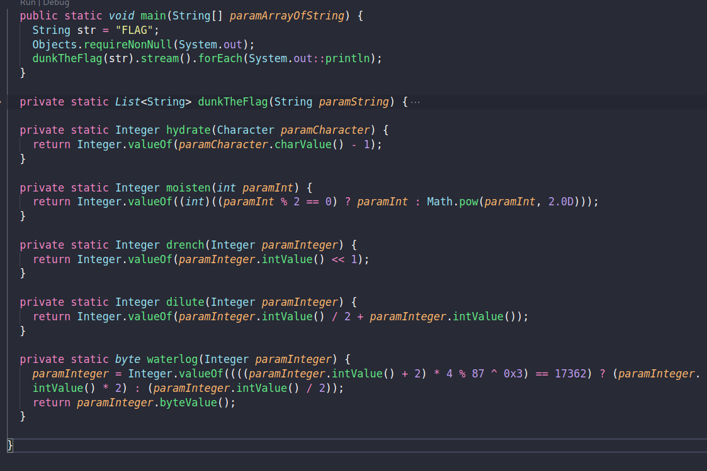

##### Rev - Easy

#### Description:
```text
Java streams are great! Why use 10 lines of completely readable code, when you could mash it all into 67 characters? +1, PR Approved!
```


- We are given a .jar and a .txt file. The jar file probably contains the encryption process and the .txt the output from the encryption. I used `jd-gui` to decompile it into a Java .class file.

- `jd-gui` is available from the kali linux repos by using the apt package manager. If you are not using kali, jd-gui can be downloaded from github https://github.com/java-decompiler/jd-gui.

- To be able to write comments, I pasted the decompiled code in a `decompiled.java` file that can be found in the sources folder. 

- The code is the following:



- We can see different integer operations that can easily be reversed:
	- `hydrate` subtracts from an ASCII value
	- `moisten` raises the even numbers to the power of 2
	- `drench` left shifts the value of a number with one bit, aka performs a multiplication by 2 
	- `dilute`  basically multiplies the input with `3/2`
	- `waterlog` performs a shift operation in a direction which is based on an simple linear equation


- The `dunkTheFlag` function does some conversion shenanigans, but the main idea is that is applies the aforementioned operations 5 times, adding a "0" delimiter between repetitions:
```java
{...}
.stream() 
.map(paramInteger -> moisten(paramInteger.intValue())) 
.map(paramInteger -> Integer.valueOf(paramInteger.intValue())
.map(Challenge::drench)
.peek(Challenge::waterlog)
.map(Challenge::dilute)
.map(Integer::toHexString)
.reduce("", (paramString1, paramString2) -> paramString1 + paramString1 + "O")
).repeat(5)
{...}
```

- To reverse the function, just create a reverse for every operation, taking into account the delimiting characters:

```py
# Split the input string by the delimiter "O" to create an array with each element
hex_array = [int(hex_num, 16) for hex_num in reduced_input.split("O") if hex_num]

# Dilute
diluted = [el * 2 // 3 for el in hex_array]

# Waterlog
waterlogged = [el // 2 if (el // 2 + 2) * 4 % 87 == 17361 else el * 2 for el in diluted]

# Drench
drenched = [el >> 1 for el in diluted]

# Moisten
moistened = [el if el % 2 == 0 else int(math.sqrt(el)) for el in drenched]

# Reverse the moistened list to obtain the hydrated list
hydrated = moistened[::-1]

# Convert the hydrated numbers to characters and print
decoded_str = "".join(chr(el) for el in hydrated)
print(decoded_str)
```

- The full script can be found in the `sources` folder
