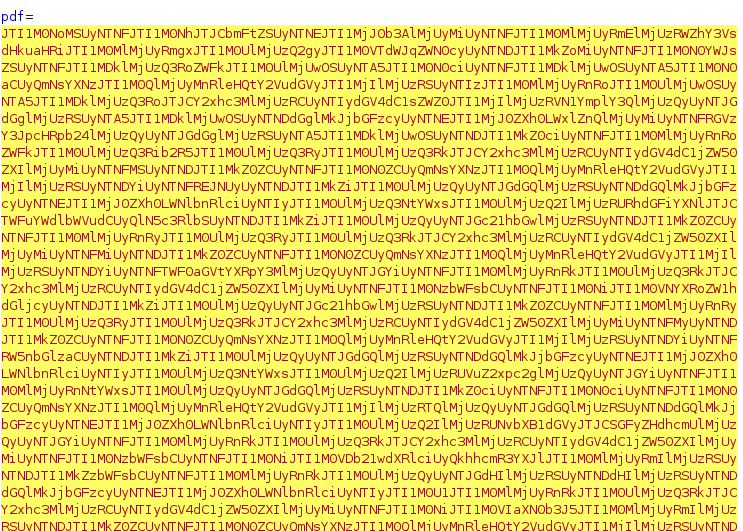
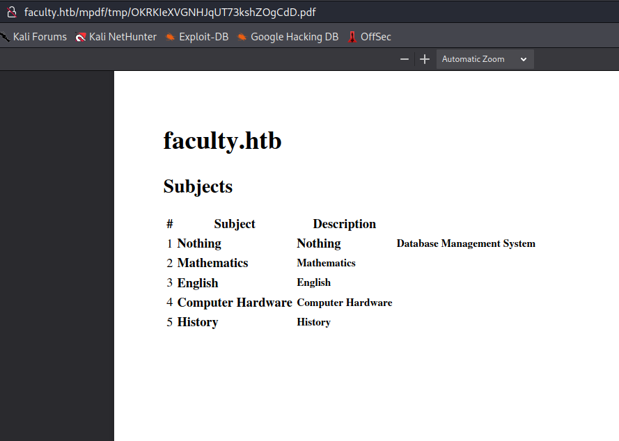
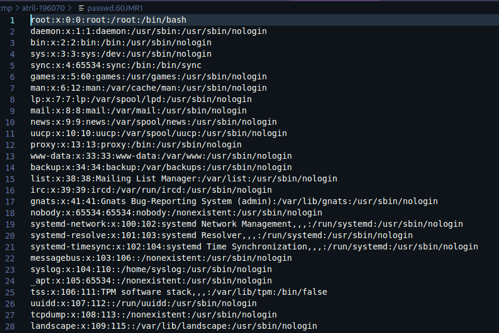
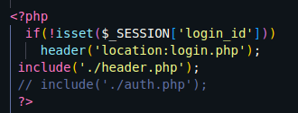
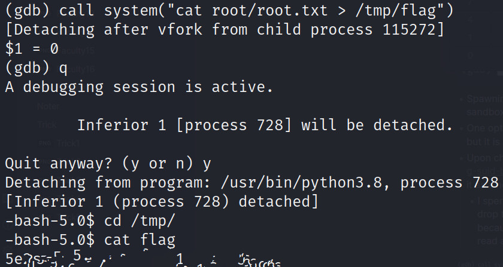

<h2> Faculty </h2>

Linux - Medium

1. Nmap scan 

~~~nmap
└─$ nmap -sC -sV -o faculty.nmap 10.10.11.169
Starting Nmap 7.92 ( https://nmap.org ) at 2022-08-30 06:03 EDT
Nmap scan report for 10.10.11.169
Host is up (0.15s latency).
Not shown: 998 closed tcp ports (conn-refused)
PORT   STATE SERVICE VERSION
22/tcp open  ssh     OpenSSH 8.2p1 Ubuntu 4ubuntu0.5 (Ubuntu Linux; protocol 2.0)
| ssh-hostkey: 
|   3072 e9:41:8c:e5:54:4d:6f:14:98:76:16:e7:29:2d:02:16 (RSA)
|   256 43:75:10:3e:cb:78:e9:52:0e:eb:cf:7f:fd:f6:6d:3d (ECDSA)
|_  256 c1:1c:af:76:2b:56:e8:b3:b8:8a:e9:69:73:7b:e6:f5 (ED25519)
80/tcp open  http    nginx 1.18.0 (Ubuntu)
|_http-title: Did not follow redirect to http://faculty.htb
|_http-server-header: nginx/1.18.0 (Ubuntu)
Service Info: OS: Linux; CPE: cpe:/o:linux:linux_kernel

Service detection performed. Please report any incorrect results at https://nmap.org/submit/ .
Nmap done: 1 IP address (1 host up) scanned in 9.77 seconds
~~~

* Change /etc/hosts file to include faculty.
* This is what we are greeted with:

* Tried to brute force the id..
~~~python
import requests
URL = "http://faculty.htb"
phpcookies = {"PHPSESSID":"p8puot3fnvvqksksq5e17ejnhn"}

print("[+] Running...")

for i in range(1,10000):
	if ( not (i % 1000) ):
		print(f"Current i: {i}")

	idData = {"id_no":i}

	if ( requests.post(URL + "/admin/ajax.php?action=login_faculty", cookies=phpcookies, data=idData ).text ) != "3":

	print(f"[!] Found Valid ID!: {i}")

~~~

* VHOST Enumeration - didnt find anything
* DIR Enumeration 
	* Found /admin login panel. Try SQL-Injection - works. (sqlmap)
		* 2 DB : information_schema | scheduling_db
			* Scheduling_db - 6 tables: class_schedule_info, courses, faculty, schedules, subjects, users
				* Users: id, name, password, type(tinyint(1) type), username
					* 1, Administrator, 1fecbe762af147c1176a0fc2c722a345
						* Found admin password hash but cannot crack it..
				* Subjects: description, id, subject
			* Found some Faculty ID's for the main panel.. Upon entering it, nothing stands out.. It's just a calendar where you can see your classes. Doesn't seem that interactible.
			* We return to the admin panel.. Knowing it is injectable, we can try to bypass the panel. 
				* "==username=anything'+or+1=1+--+&password=anything==" this payload will bypass the panel.. Notice the space after the "--" comment. This is important because the backend database is MySql and comments in MySql require a space after the usual comment syntax to work.

* The panel contains an "upload PDF" functionality, so this is probably the next step to exploit. Analysing the request, we got some large encoded data in the body:

* Burp is cool and decodes this for us automatically. It's Base64 + Triple URL encoding, which in plaintext, looks like this:
~~~html
<h1>faculty.htb</h1>
<h2>Subjects</h2>
<table>
	<thead>
        <tr>			
            <th class="text-center">#</th>
            <th class="text-left">Subject</th>			
            <th class="text-left">Description</th>			
        </tr>
    </thead>
    
    <tbody>
        <tr>
            <td class="text-center">1</td>
            <td class="text-center"><b>DBMS</b></td>
            <td class="text-center"><small><b>Database Management System</b></small></td>
        </tr>

        <tr>
            <td class="text-center">2</td><td class="text-center"><b>Mathematics</b></td>
            <td class="text-center"><small><b>Mathematics</b></small></td></tr>
            <tr><td class="text-center">3</td>
            <td class="text-center"><b>English</b></td>
            <td class="text-center"><small><b>English</b></small></td>
        </tr>

        <tr>
            <td class="text-center">4</td><td class="text-center"><b>Computer Hardware</b></td>
            <td class="text-center"><small><b>Computer Hardware</b></small></td>
        </tr>

        <tr>
            <td class="text-center">5</td>
            <td class="text-center"><b>History</b></td>
            <td class="text-center"><small><b>History</b></small></td>
        </tr>
    </tboby>
</table>
~~~

~~~html 
We control most of the <td> tags... Let's try and inject some files for LFI. For example:
            <td class="text-center"><b>DBMS</b></td>
                        should become
            <td class="text-center"><b>
                Nothing </b> </td> <a href="/etc/passwd"> Link </a> <td class="text-center"> <b> Nothing
            </b></td>
~~~

~~~html
so "DMBS" becomes " Nothing </b> </td> <a href="/etc/passwd"> Link </a> <td class="text-center"> <b> Nothing "
~~~

* This is what we got: 

- This approach did not work, so I decided to take anoter route.. Each of the uploaded files are stored in faculty.htb/mpdf/tmp/<random_name> so I looked for public exploits of mpdf

	- Found https://www.exploit-db.com/exploits/50995 which forges the request in a similar fashion as I did but with other tags
	~~~python
    payload = f'<annotation file="{fname}" content="{fname}" icon="Graph" title="Attached File: {fname}" pos-x="195" />'
	~~~
	* (Where fname is the name of the file we want to include)
		* So, seeing this, there's no need to copy and paste the script, we can just copy this payload into out encoded burp request
		* At first, I thought the payload did not work because the browser pdf preview was empty. Upon downloading the pdf, we see an clickable icon which displays the contents of the file we searched for:
		

* We see a "developer"  and "gbyolo" account on the machine. Trying to get his ssh key...
	* path : /home/developer/.ssh/id_rsa
		* no ssh key exists for developer ( or user www has no access to it )
	* path: /home/gbyolo/.ssh/id_rsa
		* no ssh key ( or no access to it )
* Tried log poisoning with /var/log/nginx/access.log as path and injection in the user agent header
	* Didnt work, service is not vulnerable to log poisoning ( user agent not injectable )

* Got nginx.conf file to see details such as root web directory location, which is not present.. 
	* Checked this post https://stackoverflow.com/a/11128102 and tried different locations for LFI
		* /usr/local/nginx/html/index.php
		* /usr/local/nginx/index.php
		* /usr/local/nginx/php/index.php
		* /var/www/index.php
		* /usr/share/nginx/www/admin/download.php
		* So on.. around 10 more :)
			* Finally tried just plain "index.php" and it worked. It seems we can just work with relative paths and not even care where everything is.
			* Started to get every php file on the server, from index.php we see we have another 3 possible files, so I just went down the php slide:
			
		* auth.php is commented so that might be interesting to look at(  instinctively )
			* upon making the request to download the pdf containing the auth.php lfi, we get a 404.. So maye the comment is just because the file no longer exists?
			
			

* header.php seems generic so next interesting file would be db_connect.php which is shown from login.php

db_connect.php : 
~~~php
<?php 

$conn= new mysqli('localhost','sched','Co.met06aci.dly53ro.per','scheduling_db')or die("Could not connect to mysql".mysqli_error($con));

~~~

* We get a password.. No db on our machine though ( remember nmap scan )
	* We could try logging in to the developer  or gbyolo account with this password.
		* developer did not work
		* gbyolo did work.. surprisingly. I though this was another rabbit hole :D 
		
* we see that he has mail.. that's certainly a hint ( or another trick to a rabbit hole :D, but we need to check it out nonetheless ) 

* using this https://devanswers.co/you-have-mail-how-to-read-mail-in-ubuntu/ we continue the work. I know I already provided a link to the resource but I have to include this paragraph here aswell because it made me laugh 

* So this is the mail that we (gbyolo) recieved:
~~~mail
From developer@faculty.htb  Tue Nov 10 15:03:02 2020
Return-Path: <developer@faculty.htb>
X-Original-To: gbyolo@faculty.htb
Delivered-To: gbyolo@faculty.htb
Received: by faculty.htb (Postfix, from userid 1001)
        id 0399E26125A; Tue, 10 Nov 2020 15:03:02 +0100 (CET)
Subject: Faculty group
To: <gbyolo@faculty.htb>
X-Mailer: mail (GNU Mailutils 3.7)
Message-Id: <20201110140302.0399E26125A@faculty.htb>
Date: Tue, 10 Nov 2020 15:03:02 +0100 (CET)
From: developer@faculty.htb
X-IMAPbase: 1605016995 2
Status: O
X-UID: 1

Hi gbyolo, you can now manage git repositories belonging to the faculty group. Please check and if you have troubles just let me know!\ndeveloper@faculty.htb

~~~

* As we see what binaries can we execute with elevated priviledges, we see this meta-git thingy.

* So turns out we didnt even have to read the mail to figure out what to do next.. 99% percent of cases where you see sudo -l output something in a htb enviroment, it will mean that particular suid'ed binary is vulnerable.. so the first thing to do is to go to GTFO Bins.
	* In here we dont find meta-git unfortunately.. so we just google for an exploit
		* https://hackerone.com/reports/728040
			* I wasted around 40 minutes to get the exploit working with developer user.. Just because I was in the home directory of gbyolo and developer was not allowed to write there.. For the PoC I kept trying to redirect the output of the whoami command to a file, so it evidently did not work.. And this small detail took me 40 minutes to realise :( . In the end though, I moved to the /tmp/ directory and all seemed fine.  So, just a hint in the future: ==never neglect user permissions==.. These simple things are often underlooked...
			* So finally, the exploit worked, so we got a reverse shell to developer:

* Grabbed the ssh key and immediately run linpeas while doing some manual recon :) 
	* First thing that linpeas returned:

* Upon looking into a github PoC of the CVE, we find this:

* To be honest, I don't have so much faith in it but let's see..
	* It did not work as account service and gnome control center were not found.. Moving on..
* Linpeas also showed that gdb is active and included in PATH. This is worth noting I think (?) Im not 100% sure since every major linux distribution comes with gdb preinsalled..
	* Upon further inspection, we see the gdb binary has the ==cap_sys_ptrace== capability.. What in the world is that, you may ask.
	
		* This capability is mandatory for gdb to work properly.

* Tried the simple approach of attaching to a root process and spawning a shell (using the built-in "shell" command from gdb) but since gdb was ran from the developer user, the shell will be in the context of the developer, not root.
* Looked at interesting processes, did not find anything that stood out
* Looked at crontabs, found the sendmail.sh script that constantly sends an email to gbyolo.. but it has nothing to do with root so no privesc path there..
* After half an hour, realised that the current user is part of the (debug) group..

* Decided to take a look at what processes are running under this group 
	* Did not find anything useful..
* Next thought was to brute force processes that are owned by root and contain the "system" symbol, in order to call that function and spawn a shell that way. 
	* This should have been done with a script but it needed to execute commands in a gdb context and I found that to take me longer than just manually attaching to each process ( there are around 8 )
	* Finally, process 728 had the symbol.

* Spawning a root shell in the normal way won't work, because the shell enviroment will be sandboxed by gdb. 
* One option is to cat the flag and create another file which will be then read.. This works but it is not proper privesc.

* Upon checking this article: https://www.hackingarticles.in/linux-privilege-escalation-using-suid-binaries/, we can try and apply the SUID bit to the bash file and then just execute it as a normal user.
	* I spent another 30 minutes trying to figure out why executing the bash binary will still drop the suid priviledge.. Until I found out that bash -p will give the result we need, because it inherits the enviroment from the SUID and thus allowing us to read any file of root.

