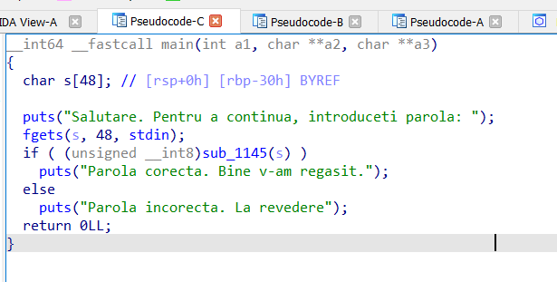
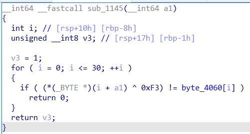

# the_pass_pls

* Description:
~~~sql
You have to perform reverse engineering on a binary and retrieve the flag.
~~~

* Simple enough, we are given a ELF executable which looks normal for the most part.

* Using IDA and decompiling "main", we find the following code:

* The program uses a secure version of gets (fgets from stdin) to fetch 48 bytes from the user and then calls a intresting routine, which was named as "sub_1145" by IDA. Checking that function:

* Function checks if a bitwise xor of the input variable gives the same output as an hardcoded global variable in memory, namely "byte_4060"
 
~~~python
Knowing that a xor b = c <=> c xor b = a <=> c xor a = b,
writing a simple script will give us the flag. (script is in repo)
~~~

~~~bash
PS D:\Coding\CTF\Unbreakable\Prep\the_pass_pls> py .\solve.py
CyberEdu{C0ngr4ts_y0u_f0und_1t}
~~~
