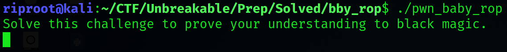
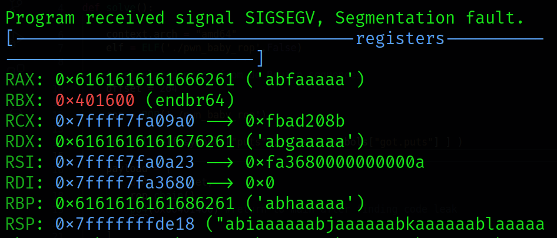

# baby_rop

Description:
~~~
This is a simple pwn challenge. You should get it in the lunch break.

Running on Ubuntu 20.04.

About the challenge
The challenge was initially published at European Cyber Security Challenge 2020 - the national phase organised in Romania. The challenge was created by Bit Sentinel.

European Cyber Security Challenge (ECSC) is the annual European event that brings together young talent from across Europe to have fun and compete in cybersecurity!
~~~

* Running the executable, we are greeted with a simple "welcome" message, allowing us the enter input:

* Using a immense number of bytes as input, we get a segfault.

### Finding the overflow offset

~~~bash
#Generate a de Brujin sequence of 1024 characters and distinct of 8 to locate the exact offset of the buffer overflow exploit
$ python3 -c 'from pwn import *;print(cyclic(1024,n=8))' > payload.txt

$ gdb ./baby_rop

#Inject it in the process
gdb-peda$ r < payload.txt
~~~

~~~bash
$ python3 -c 'from pwn import *;print(cyclic_find('abhaaaaa', n=8))'

$ 256
# RBP was injected with this string, so to overflow the instruction pointer, we must move an additional 8 bytes
~~~

* The rest of the exploit is explained in the script itself

